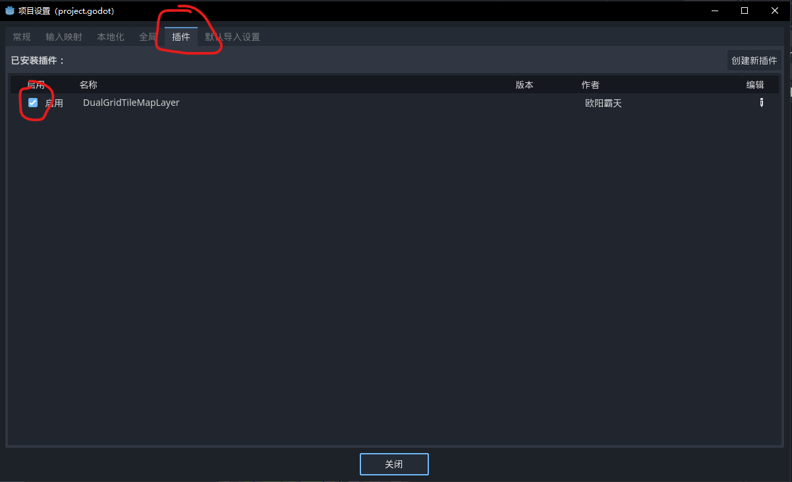

# Godot-dual-grid-plugin
# Godot双网格瓦片地图插件

## 安装
	将文件夹放进项目根目录的addons文件夹中(如果没有就创建一个)

	再在 项目 → 项目设置 → 插件 中启用DualGridTilemapLayer即可

## 设置
	目前只支持正方形总计6块图块的瓦片集;

	瓦片集模板按以下绘制:

	并且按以下顺序设置备选图块:

	如何设置备选图块：

	在tileset面板中

	点击选择

	右键需要创建的图块生成备选图块

	加号生成更多的备选图块

	选择备选图块并在左侧渲染栏中编辑为模板样式

	将设置好的tileset设置给插件节点即可

## 使用
	使用占位符进行绘制,而且你可以在编辑器中预览,不过整片图块编辑时需要再次点击鼠标才会渲染修改

	使用此节点的set_tile(vector2)来进行程序化绘制,在指定世界网格的坐标绘制图块

## 其他
	目前此插件一个图层只支持一种地形,不过我也建议一个图层只使用一个地形,一来我可以懒得更新匹配多种地形的功能(不是),二来可以避免绘制指数级增长的图块,将优先级更高的图块显示在更上方即可

	绘制图块需要注意的
	斜向的路径会很奇怪,尽量避免绘制这种地形,而绘制更宽的斜向路径
